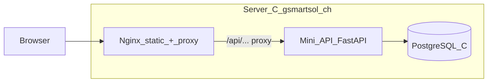

# GSmartSol Notify: DB auf Server C (unabhängig von Server B)

**Workspace:** [finalstage.ch](https://finalstage.ch) — dieses Repo; dieser Plan betrifft nur die Notify-/Server-C-Auslagerung (nicht die Kern-Turnier-App).

## Ziel

- **Verteilerliste** (E-Mails aus „Notify me“) in einer **eigenen Datenbank auf Server C**.
- **Unabhängig** vom FinalStage-Backend und der PostgreSQL-Instanz auf **Server B**.
- **Landing** bleibt statisch auf C; nur **Ziel-URL** und **Nginx** werden so angepasst, dass Requests **auf C** landen.

**Entscheidung:** PostgreSQL auf Server C (vom Nutzer gewählt).

## Architektur

- **Nginx** auf C: weiterhin `root` für `/` und statische Dateien; zusätzlich **`location`** z. B. ` /api/` → `proxy_pass http://127.0.0.1:<port>` zum Mini-API-Container/Prozess.
- **Mini-API** (eigenständiger kleiner Dienst, **nicht** das Monolith-Backend in `backend/`): nur `POST /api/v1/gsmartsol/notify` (+ optional `GET /health`), gleiches JSON-Verhalten wie bisher (Honeypot, Antworten), **Persistenz nur in PostgreSQL auf C**, optional SMTP-Benachrichtigung an Admin (konfigurierbar via `.env` auf C – kann gleiche Logik wie heute sein, aber SMTP von C aus).
- **PostgreSQL** auf C: nur Schema für z. B. `gsmartsol_notify_subscribers` (`id`, `email` UNIQUE, `created_at`).

## Was am Monolith-Backend (B) passiert

- Den bisherigen Endpoint **`/api/v1/gsmartsol/notify`** in [`backend/app/api/v1/gsmartsol_notify.py`](backend/app/api/v1/gsmartsol_notify.py) **entfernen** oder durch einen **410 Gone** / kurze Hinweis-Response ersetzen, damit keine doppelte Speicherung und keine Verwechslung entsteht.
- [`main.py`](backend/app/main.py): Router `gsmartsol_notify` **nicht mehr einbinden**.
- **Wichtig:** [`nginx/gsmartsol-www/index.html`](nginx/gsmartsol-www/index.html) Meta **`gsmartsol-notify-api`** auf **dieselbe Origin** stellen, z. B. `https://gsmartsol.ch/api/v1/gsmartsol/notify` (Pfad muss exakt zu Nginx-Proxy und Mini-API passen).

## Repo-Umfang (Vorschlag)

| Teil | Inhalt |
|------|--------|
| Neuer Ordner z. B. `gsmartsol-api/` oder `nginx/gsmartsol-api/` | Dockerfile, `requirements.txt` (FastAPI, uvicorn, SQLAlchemy, psycopg2), kleines `main.py` mit gleicher Geschäftslogik wie der aktuelle Notify-Handler (inkl. Honeypot, optional SMTP) |
| SQL-Migration | `migrations/add_gsmartsol_notify_subscribers.sql` – für **Postgres auf C** (CREATE TABLE …) |
| `docker-compose` (nur für C oder override) | Service `postgres` + Service `gsmartsol-api` mit `DATABASE_URL` auf den C-Postgres |
| Nginx-Beispiel | Snippet `location /api/` → Proxy zum API-Container (kann in bestehendes `patch_nginx.py` auf C oder separate `conf` einfließen) |

Kein Mischen dieser Tabelle mit der DB auf B.

## Rollout Server C

1. PostgreSQL starten (Docker/Volumes), Migration ausführen.
2. Mini-API bauen/starten, `.env` mit `DATABASE_URL`, optional SMTP.
3. Nginx: Proxy für `/api/` testen (`curl` lokal und mit Host `gsmartsol.ch`).
4. Statische `index.html` deployen mit Meta-URL auf `https://gsmartsol.ch/...`.
5. Auf **B** Backend deployen **ohne** den alten Notify-Router.

## Nicht im Scope

- Admin-UI zum Export (weiterhin SQL/pg_dump oder späteres Tool).
- Änderungen an FinalStage-Domains außer Entfernen des doppelten Endpoints auf B.

## Rollback (falls etwas schiefläuft)

Ja, der Stand ist **reversibel** – typischerweise in umgekehrter Rollout-Reihenfolge:

1. **`index.html` auf C:** Meta `gsmartsol-notify-api` wieder auf die **bisherige** API setzen (z. B. `https://test.finalstage.ch/api/v1/gsmartsol/notify`) und deployen – das Formular spricht wieder B an (sofern der Endpoint dort **noch existiert**).
2. **Server B:** Vorübergehend den **alten** `gsmartsol_notify`-Router und `main.py`-Include **aus Git wiederherstellen** und Backend neu deployen, falls Schritt 1 wieder nach B zeigen soll.
3. **Server C:** Nginx-`location` für `/api/` **deaktivieren** oder entfernen, Mini-API-Container **stoppen** – statische Seite bleibt erreichbar.
4. **PostgreSQL auf C:** Container/Volumes können stehen bleiben (Daten gehen nicht verloren) oder bei Bedarf **Backup** vor größeren Änderungen (`pg_dump`).

**Hinweis:** Rollback ist am einfachsten, wenn der **Git-Stand** vor der Änderung erhalten bleibt (Branch/Tag) und Deploy-Skripte dieselben Pfade nutzen. Daten, die **nur auf C** in der neuen Tabelle landen, sind nach einem harten Rollback der DB ggf. nur noch aus Backup wiederherstellbar.
