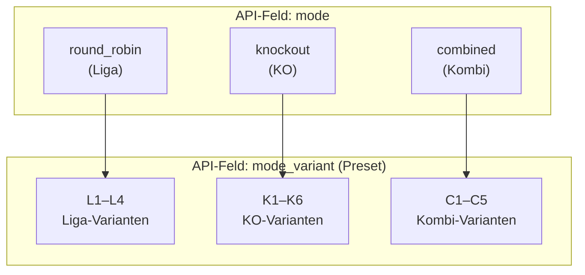
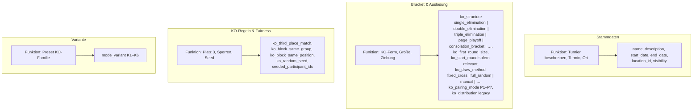
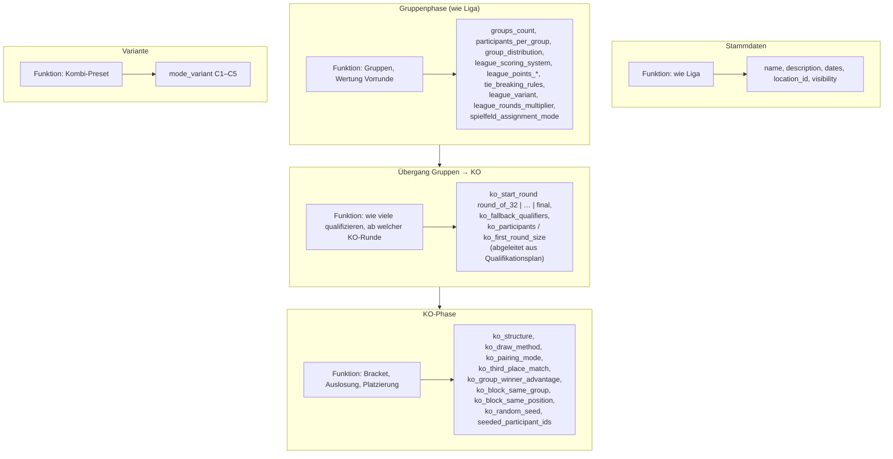

# Turnier-Modi: Funktionen und Einstellungen (Referenz)

**Zweck:** Projektdokumentation – Überblick, welche **Funktionsbereiche** es pro Grundmodus gibt und welche **Einstellungsfelder** (API/Formular) dazu gehören.  
**Nicht:** Bestandteil der Endnutzer-Oberfläche; dient Abstimmung, Tests und Weiterentwicklung.

**Quelle im Code:** u. a. `frontend/src/types/index.ts` (`Tournament`), `frontend/src/pages/CreateTournament.tsx`, `frontend/src/domain/tournamentModeMatrix.ts`.

---

## 1. Übersicht: Grundmodus → Modus-Varianten (L / K / C)

**Hinweis:** Beim Wechsel von `mode_variant` setzt `variantToPreset` u. a. `ko_structure` sowie `has_group_phase` / `has_ko_phase` passend zur Variante.

Die **Variante** (L1 … C5) wählt ein **Preset** aus (u. a. `ko_structure`, Phasen-Flags); die folgenden Diagramme sind nach **Grundmodus** gegliedert, weil sich die **aktiven Einstellungen** daran orientieren.

---

## 2. Modus Liga (`mode = round_robin`)

**Typische Funktion:** nur Gruppen-/Ligaphase, keine KO-Phase im Turnier (`has_ko_phase = false`, `has_group_phase = true`).

```mermaid
flowchart TB
  subgraph stamm["Stammdaten & Ort"]
    F0["Funktion: Turnier beschreiben, Termin, Ort"]
    E0["name, description, start_date, end_date,\nlocation_id, visibility"]
  end

  subgraph gruppen["Gruppen & Auslosung"]
    F1["Funktion: Gruppen einteilen, Rundenschema"]
    E1["groups_count, participants_per_group,\ngroup_distribution random|seeded|manual,\nleague_variant classic|double|multiple,\nleague_rounds_multiplier"]
  end

  subgraph wertung["Liga-Wertung & Tie-Break"]
    F2["Funktion: Punkte, Rangfolge bei Gleichstand"]
    E2["league_scoring_system points|difference|wins,\nleague_points_win, league_points_draw, league_points_loss,\ntie_breaking_rules[], Entscheidungsspiel-Logik"]
  end

  subgraph betrieb["Spielbetrieb & Anzeige"]
    F3["Funktion: Felder, Tabellen, Schiedsrichter"]
    E3["spielfeld_assignment_mode random|group_fixed|group_random,\nshow_matches, show_tables,\nhead_referee, scorekeeper"]
  end

  subgraph meta["Modell & Vorlage"]
    F4["Funktion: Variante, Vorlage, Seeds"]
    E4["mode_variant L1–L4,\nis_template, seeded_participant_ids optional"]
  end

  F0 --> E0
  F1 --> E1
  F2 --> E2
  F3 --> E3
  F4 --> E4
```

---

## 3. Modus KO (`mode = knockout`)

**Typische Funktion:** direktes KO-Bracket (`has_ko_phase = true`, `has_group_phase = false`).

**Hinweis:** `ko_group_winner_advantage` ist in der Regel für **Kombi** relevant, nicht für reines Liga-KO in Isolation (siehe Kombi-Diagramm).

---

## 4. Modus Kombi (`mode = combined`)

**Typische Funktion:** Gruppen-/Ligaphase **und** anschließende KO-Phase (`has_group_phase = true`, `has_ko_phase = true`).

---

## 5. Modus-Varianten L1–C5 (Kurzüberblick)

Nur **inhaltliche** Einordnung; technisch sind die Details in `MODE_VARIANTS` in `frontend/src/domain/tournamentModeMatrix.ts` und die Presets in `variantToPreset` in `CreateTournament.tsx`.

| Familie | IDs   | `baseMode` (Matrix)   | Kurzbeschreibung (Matrix)        |
|---------|-------|------------------------|----------------------------------|
| Liga    | L1–L4 | `round_robin`          | Rundensysteme inkl. Swiss (L4)    |
| KO      | K1–K6 | `knockout`             | Single/Double/Triple, Page, …    |
| Kombi   | C1–C5 | `combined`             | Gruppen/Swiss → KO / Page / …    |

---

## Rendering

- **GitHub / GitLab:** Mermaid wird in vielen Markdown-Views gerendert.  
- **VS Code:** Extension „Markdown Preview Mermaid Support“ o. Ä.  
- **Lokal:** [Mermaid Live Editor](https://mermaid.live)

---

*Stand: abgeleitet aus dem ibu_sw-Frontend-Turnierformular und `Tournament`-Typ; bei API-Änderungen diese Datei mitpflegen.*
